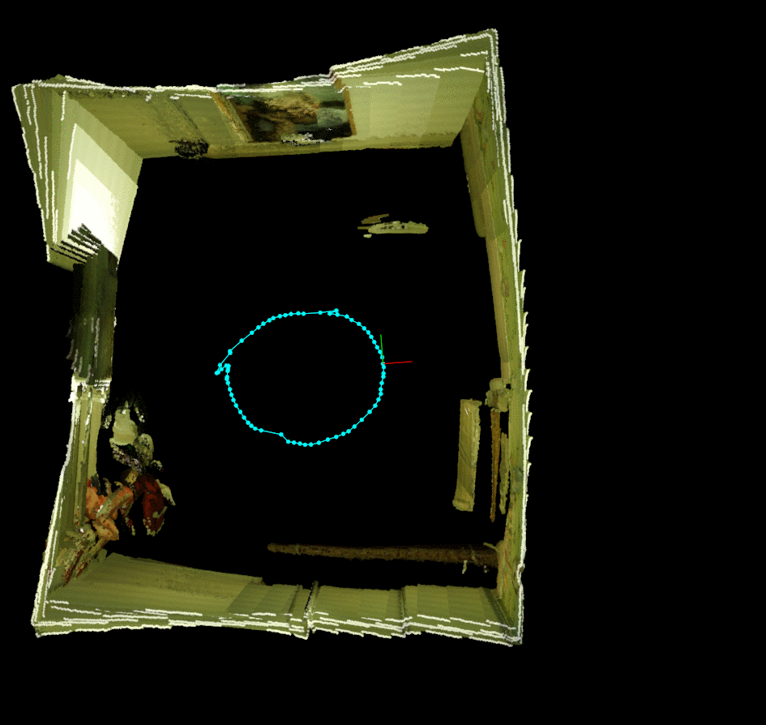
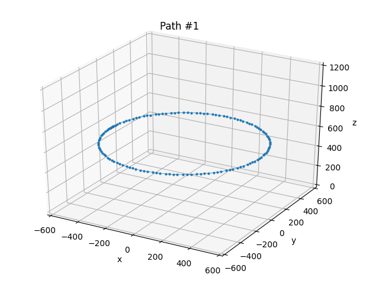
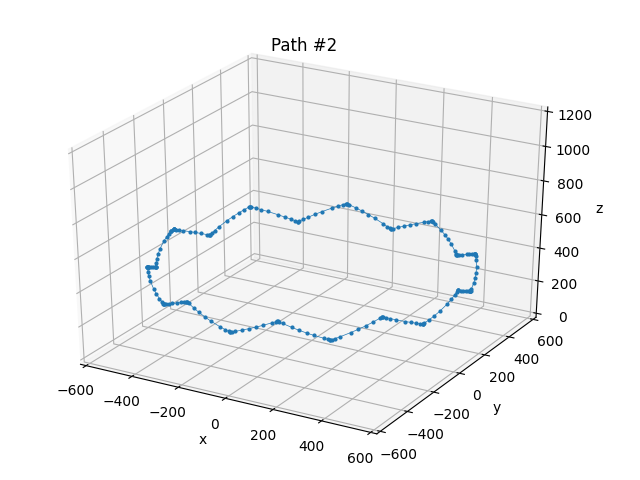
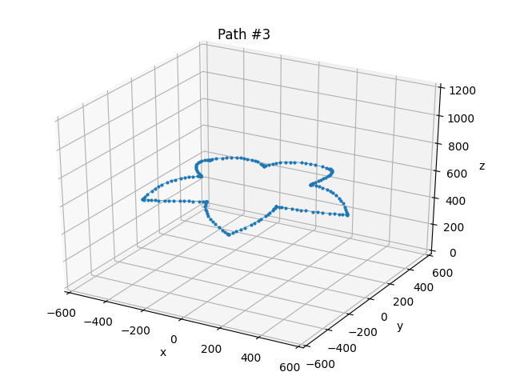

# Comparison of 10 RGB-D sensors regarding 3D reconstruction applications.

The use of low-cost RGB-D sensors became popular with the release of Microsoft Kinect V1, in 2010. From that time on, different companies such as ASUS, Orbbec, and Intel have developed their solutions for capturing 3D data. This work proposes an analysis of how well 10 RGB-D sensors perform while applied to a 3D reconstruction task. The comparison was possible by using COMAU's e.Do robotic Arm for ensuring all sensors performed the same set of 3 different paths while capturing RGB and Depth data from the test environment. A customized version of RTAB-map, an open-source solution for real-time appearance-based mapping, was developed so that all ten sensors were supported by the same tool for capturing data, since RTAB-map's original data recorder module did not support Astra Pro device and Realsense devices were not included in the tool. All evaluations were performed in a controlled indoor scenario, built to address different characteristics on the same scene: highly texturized regions, poorly texturized regions, close and far objects. Almost 20GB of data was collected and is available as a public dataset for future comparison of 3D reconstruction algorithms that receive input from different RGB-D sensors.

## Evaluated sensors:

1. Orbecc Astra 
2. Orbecc Astra Pro
3. Microsoft Kinect V1
4. Microsoft Kinect V2
5. Asus Xtion
6. Realsense D435
7. Realsense F200
8. Realsense SR300
9. Realsense R200
10. Realsense ZR300

## Customized RTAB-map
- Platform: Windows
- All 10 previously mentioned RGB-D sensors supported
- [Download here](https://drive.google.com/file/d/1Tx94n2ljFQZ7NtzMqQ2J-XayHzL929np/view?usp=sharing)

## Paths performed:
 

## Files for controlling the e.Do paths:
- [Path1.py](./src/path1.py)
- [Path2.py](./src/path2.py)
- [Path3.py](./src/path3.py)

All python files require the pyedo library (https://github.com/Comau/pyedo).

## First-person videos for all 3 paths:
- [path1](https://drive.google.com/file/d/1ull5EqOhYAkPiHJBlVHrsLnqj-sUDBUo/view?usp=sharing)
- [path2](https://drive.google.com/file/d/1nZbACYevvxTiXeS9bCg68zwpTzkcdDlB/view?usp=sharing)
- [path3](https://drive.google.com/file/d/1OM4w60n3mFLSUgJasI98zOLatBtowqZV/view?usp=sharing)
 
### Astra
#### Path 1:
- [DB File](https://drive.google.com/file/d/1fqQBkJvYnuCQf4pXdzCmfwEIYur8cYOP/view?usp=sharing)
- [Camera Calibration file](https://drive.google.com/file/d/1gdnpyeR1NMLsaISNWQaZ5c4_zzTLigzg/view?usp=sharing)
- [Point Cloud](https://drive.google.com/file/d/1DImjE_GsZbbYq8-5YCvuK68Ie642BXMH/view?usp=sharing)
#### Path 2:
- [DB File](https://drive.google.com/file/d/1F3xoNy6RGCTapNlJd_tY_49trX6Dug_I/view?usp=sharing)
- [Camera Calibration file](https://drive.google.com/file/d/1dqDWsar6EfGQ_k-MJzjAA1LjrJpMjVY7/view?usp=sharing)
- [Point Cloud](https://drive.google.com/file/d/1esqsW95DJr04xJ9wo_vobmO4_MlWEb7p/view?usp=sharing)
#### Path 3:
- [DB File](https://drive.google.com/file/d/1VEPzl83gdD-ry8bC0a5qRK2Dq8uMMT_S/view?usp=sharing)
- [Camera Calibration file](https://drive.google.com/file/d/1Tan2sZUNeF19vaN6wDdh3OcgJf24jNG7/view?usp=sharing)
- [Point Cloud](https://drive.google.com/file/d/1daEkattKgGmFY16wsTQZ8S2X77zFXE5-/view?usp=sharing)

### Astra Pro
#### Path 1:
- [DB File](https://drive.google.com/file/d/1lJmOiwJ4HIt6b1jD8QhMZ8h4hLTzGl8a/view?usp=sharing)
- [Camera Calibration file](https://drive.google.com/file/d/1elsPU_OVFOPxDyOS1y077hWMGlIzsOBr/view?usp=sharing)
- [Point Cloud](https://drive.google.com/file/d/1Lrt3JLNlblFAAci-HW-vmtunLOJ6skvS/view?usp=sharing)
#### Path 2:
- [DB File](https://drive.google.com/file/d/12Abq1djqlife0iEYYvcGYdhbZGmrtFNZ/view?usp=sharing)
- [Camera Calibration file](https://drive.google.com/file/d/14mZpwLP14Ho9eFx9ZT0GZclvKzp88Zk2/view?usp=sharing)
- [Point Cloud](https://drive.google.com/file/d/1CXRzUnx0kndxJe-EtRQtLjtxDxfBPTkU/view?usp=sharing)
#### Path 3:
- [DB File](https://drive.google.com/file/d/1eHoO6THCkcpdzM6wZ6Dr3ghGwzS9WuAu/view?usp=sharing)
- [Camera Calibration file](https://drive.google.com/file/d/1he_BNKPF2iwtFVFn8n2UdHNcjHhkXnw6/view?usp=sharing)
- [Point Cloud](https://drive.google.com/file/d/1ldd37bHwbLal_lAOhAnvnNuNz9VID4st/view?usp=sharing)

### D435
#### Path 1:
- [DB File](https://drive.google.com/file/d/1LKBKZ7DqgSDISubxaGICRP4fhSJQKlHG/view?usp=sharing)
- [Camera Calibration file](https://drive.google.com/file/d/1bFuvJlcRXzOWqOuJQemtpD99RJAS0xL5/view?usp=sharing)
- [Point Cloud](https://drive.google.com/file/d/1yjtQmsJP-TkHbbitirqC61k0L0MP19rN/view?usp=sharing)
#### Path 2:
- [DB File](https://drive.google.com/file/d/1syyaryw8rCJYiQaw4p2zGIRqOFK0YdSN/view?usp=sharing)
- [Camera Calibration file](https://drive.google.com/file/d/1bFuvJlcRXzOWqOuJQemtpD99RJAS0xL5/view?usp=sharing)
- [Point Cloud](https://drive.google.com/file/d/1-EBvXT0X30i92cT-cU74QhVrQKBavI0S/view?usp=sharing)
#### Path 3:
- [DB File](https://drive.google.com/file/d/1Hinw3mhsJb0DfwmJFf05eqh0t1z-BrFR/view?usp=sharing)
- [Camera Calibration file](https://drive.google.com/file/d/1lSgGiDNrlTBilBVuMkfNlcea8lNU7zUW/view?usp=sharing)
- [Point Cloud](https://drive.google.com/file/d/1EloWrvpgWSHIaIqXDxtBpabfus-4kgVK/view?usp=sharing)

### F200
#### Path 1:
- [DB File](https://drive.google.com/file/d/1fcG8x99-jgk_4e3q8LEcorbnOxJ6EaC6/view?usp=sharing)
- [Camera Calibration file](https://drive.google.com/file/d/1ccGHerWM2rLucDlgVoZJ0xfY-qua-EFU/view?usp=sharing)
- [Point Cloud](https://drive.google.com/file/d/1d-Ai7g-DhYuQt1GIkPnnnKwBf8gBk7Ov/view?usp=sharing)
#### Path 2:
- [DB File](https://drive.google.com/file/d/1TWoq0dtotccTPdZjBmCxX0WsdW1amKz_/view?usp=sharing)
- [Camera Calibration file](https://drive.google.com/file/d/1V9ZT63BoBXpXMaLM1RXqdqB5v2OfedwF/view?usp=sharing)
- [Point Cloud](https://drive.google.com/file/d/1qqNyORZDyQDaUI5CNEf4h4R1lgJb4oDP/view?usp=sharing)
#### Path 3:
- [DB File](https://drive.google.com/file/d/13JzsM7_SDQ7yY25mS92sugSv-Btmcv0R/view?usp=sharing)
- [Camera Calibration file](https://drive.google.com/file/d/1ZGW9lsgmikKwO19CmIp8pCTpUmPSEMB5/view?usp=sharing)
- [Point Cloud](https://drive.google.com/file/d/1UPISwP-s-mqmO0cFCWSA-FWYEmFKNRt3/view?usp=sharing)

### Kinect V1
#### Path 1:
- [DB File](https://drive.google.com/file/d/1Cn7VrKtL3h5qn-aeL6OsK9KPfHtmOVIN/view?usp=sharing)
- [Camera Calibration file](https://drive.google.com/file/d/1tfhfLUSuOsJsNGweysvwsfoHSCgf1XQe/view?usp=sharing)
- [Point Cloud](https://drive.google.com/file/d/1M7u3W1xT9ayVNNPSIQGDKUvZAUBhQmxG/view?usp=sharing)
#### Path 2:
- [DB File](https://drive.google.com/file/d/1SA-et-WWM4JFLzCLIyl5JmcXrhvY9j3l/view?usp=sharing)
- [Camera Calibration file](https://drive.google.com/file/d/1HOh1ZGDnRGMDgs64jjuIRVA92LI4d1ZE/view?usp=sharing)
- [Point Cloud](https://drive.google.com/file/d/1tgai4Tbqm-tOOCCX8og7eKvyXA8cGoDi/view?usp=sharing)
#### Path 3:
- [DB File](https://drive.google.com/file/d/18VsLmXB13FMO3-vAbWNtL57_y9Nw_l9P/view?usp=sharing)
- [Camera Calibration file](https://drive.google.com/file/d/1NkPf1upJVqN2ub10xWG1YgtNXtuplxI3/view?usp=sharing)
- [Point Cloud](https://drive.google.com/file/d/1lWMzjKiyf2d6UysmSsN4MI_vLzCXKETZ/view?usp=sharing)

### Kinect V2
#### Path 1:
- [DB File](https://drive.google.com/file/d/12Q6x0bdFn3zqNZhzerbNz5lNiFlVWCn2/view?usp=sharing)
- [Camera Calibration file](https://drive.google.com/file/d/16aQ4w8lUvMsvj8th0jNVwFIVBsXNeY17/view?usp=sharing)
- [Point Cloud](https://drive.google.com/file/d/1Gf9y3-KTfUVR3k-Jp5Lao20AZQ-D8tw9/view?usp=sharing)
#### Path 2:
- [DB File](https://drive.google.com/file/d/1FRGmBBKWDJO5sOxSc_2IuNBJgOkKFKYp/view?usp=sharing)
- [Camera Calibration file](https://drive.google.com/file/d/1ekemwwfJNc8AtUqK33hxk9PI1nzwOMoa/view?usp=sharing)
- [Point Cloud](https://drive.google.com/file/d/1uc6zApPcflimbfvHHLc7_B9YcdQOH4JP/view?usp=sharing)
#### Path 3:
- [DB File](https://drive.google.com/file/d/10MkCMJ49Q4JbI5sIGj35mHD_YXoQDVXk/view?usp=sharing)
- [Camera Calibration file](https://drive.google.com/file/d/1kOI848d051lKIbWWUNp3dAw2S6Y6MEX6/view?usp=sharing)
- [Point Cloud](https://drive.google.com/file/d/1r4zDQV8MlQkNlEYkMRxggvsQiupK_ryK/view?usp=sharing)

### R200
#### Path 1:
- [DB File](https://drive.google.com/file/d/1DveYxKZQYVL9852A91gfzy0wWz7SGVEz/view?usp=sharing)
- [Camera Calibration file](https://drive.google.com/file/d/1Gq5S5U83PC2JxND-tZO7TjQ8RK7sM8ee/view?usp=sharing)
- [Point Cloud](https://drive.google.com/file/d/1qrNX2s-F_1aJRIEQlRQhCb54GZ1JeLvO/view?usp=sharing)
#### Path 2:
- [DB File](https://drive.google.com/file/d/1YHySOxHqcxlFVikKQ-9e9BO2AqUJJlbn/view?usp=sharing)
- [Camera Calibration file](https://drive.google.com/file/d/1Ff18Q5ArUCVIGH7GR_w7R8u24oax4bWQ/view?usp=sharing)
- [Point Cloud](https://drive.google.com/file/d/1II6t8AoXplW4JW4c_7MnoBK-txCm_J6x/view?usp=sharing)
#### Path 3:
- [DB File](https://drive.google.com/file/d/1Qle5WWSI_53lj6oH6WOW417GpuZ6Vt-I/view?usp=sharing)
- [Camera Calibration file](https://drive.google.com/file/d/1CO-bYMjHOTOXm82MvWTMXQB4jPsbCYCB/view?usp=sharing)
- [Point Cloud](https://drive.google.com/file/d/1o8hddphQvekIRGl5FtWEGyq_e22mBZWI/view?usp=sharing)

### SR300
#### Path 1:
- [DB File](https://drive.google.com/file/d/1-_cDRV_EI5cL_OqlzNtRWxJ8Pe49VbYa/view?usp=sharing)
- [Camera Calibration file](https://drive.google.com/file/d/13zufTisQaazl9AXq15jYBwAG6SzZPdT-/view?usp=sharing)
- [Point Cloud](https://drive.google.com/file/d/1MGIwK5t9G_Cb3MaVvcp_eXOI6EcJBcum/view?usp=sharing)
#### Path 2:
- [DB File](https://drive.google.com/file/d/1qLxEpnJgkekQE0ODnk665SiYz3-vqLKz/view?usp=sharing)
- [Camera Calibration file](https://drive.google.com/file/d/1ciC1itVb8Z3DztLmMFYXZR4g07Aro7vm/view?usp=sharing)
- [Point Cloud](https://drive.google.com/file/d/1ePpud0uoSjbTcznldFIXJ6dSdTSusXWy/view?usp=sharing)
#### Path 3:
- [DB File](https://drive.google.com/file/d/1lLsvkrqheX-CjDmiMeP1_Hem7w09dzzt/view?usp=sharing)
- [Camera Calibration file](https://drive.google.com/file/d/1QQQ3lKM4uqDl46tBuIvsHexWG9yhjtjv/view?usp=sharing)
- [Point Cloud](https://drive.google.com/file/d/1XI7jf0NhVPdbx1OOXHgrl9D1RWTvhN8O/view?usp=sharing)

### Xtion
#### Path 1:
- [DB File](https://drive.google.com/file/d/1m5FZZxoX6c6t2S-kQerGSgSTKCFbOupR/view?usp=sharing)
- [Camera Calibration file](https://drive.google.com/file/d/1vXcpPmADhRomwHA1caDuYqf93r9a5Yhp/view?usp=sharing)
- [Point Cloud](https://drive.google.com/file/d/18nXXDHyFxIhQVg_kRL3iCpGuxj-IQ4qb/view?usp=sharing)
#### Path 2:
- [DB File](https://drive.google.com/file/d/1q3oq3qyaV7DBHMjdfahNBP4wmsIGRTHR/view?usp=sharing)
- [Camera Calibration file](https://drive.google.com/file/d/1TukujSwYB59-FV76yh3Qe1bo-XQiRZZm/view?usp=sharing)
- [Point Cloud](https://drive.google.com/file/d/1jPE1GQunBZpiyn71YkbBVttqGhNM8EcF/view?usp=sharing)
#### Path 3:
- [DB File](https://drive.google.com/file/d/1kfRoN1Y4Jl5w_5JyjIc_h0NvZHm-bJi5/view?usp=sharing)
- [Camera Calibration file](https://drive.google.com/file/d/1w_z24srDKIfos9Cqn8lQE000n8CdF4Wj/view?usp=sharing)
- [Point Cloud](https://drive.google.com/file/d/11HIpNe-9U1ipoE-0fg6byiZDrYBY3okp/view?usp=sharing)

### ZR300
#### Path 1:
- [DB File](https://drive.google.com/file/d/1X294L7q-sM50hHQj0J36rcQrnLpEvgG8/view?usp=sharing)
- [Camera Calibration file](https://drive.google.com/file/d/1LnS3eDEvsKMWlIJwIoblEvUF0CKRJEC6/view?usp=sharing)
- [Point Cloud](https://drive.google.com/file/d/1rHKXsGTIxokHY9zbwneLV0e8tehwZtUx/view?usp=sharing)
#### Path 2:
- [DB File](https://drive.google.com/file/d/1pFLIUTQozkCYW7cNxF8wYAYM3beu5jir/view?usp=sharing)
- [Camera Calibration file](https://drive.google.com/file/d/170pV4xLdvYy9KofRK01gFUvTHr-QFT1n/view?usp=sharing)
- [Point Cloud](https://drive.google.com/file/d/1ItQ95dmK-NJPPZLTqi99tqWNnaQdn43Z/view?usp=sharing)
#### Path 3:
- [DB File](https://drive.google.com/file/d/1ur6pGCiLpDOq5FetkYYbUDssyNxs-w8Y/view?usp=sharing)
- [Camera Calibration file](https://drive.google.com/file/d/1UwKTwyPD5g81E6-k6zVKumcmARL9OTHi/view?usp=sharing)
- [Point Cloud](https://drive.google.com/file/d/1Zs7sompUhzLmdRZnYRqzLlPTXlV1LROL/view?usp=sharing)
